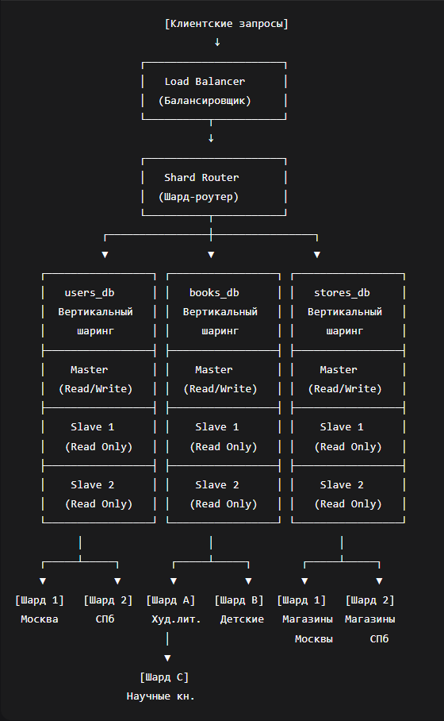

# Домашнее задание к занятию «Репликация и масштабирование. Часть 2»

**Выполнил:** Даниил Дудников

---

## Задание 1. Преимущества методов масштабирования

### 1. Активный Master + пассивный Slave

**Основные преимущества:**
- **Распределение нагрузки:** Master обрабатывает операции записи, Slave обслуживает запросы чтения
- **Резервная копия:** Slave служит "горячей" резервной копией для быстрого восстановления
- **Простота настройки:** Конфигурация проще, чем Master-Master репликация
- **Безопасное тестирование:** На Slave можно тестировать обновления без риска для production

### 2. Master + несколько Slave

**Дополнительные преимущества:**
- **Масштабирование чтения:** Добавление Slave серверов увеличивает capacity операций чтения
- **Отказоустойчивость:** При выходе из строя одного Slave остальные продолжают работу
- **Балансировка нагрузки:** Запросы чтения распределяются между несколькими Slave
- **Специализация:** Разные Slave можно настроить под конкретные задачи (аналитика, отчеты, бэкапы)

---

## Задание 2. План горизонтального и вертикального шаринга

### Контекст: Магазин книг "Читай-Город"
- 1 млн пользователей
- 500 тыс. книг
- 100 магазинов по России

### 1. Вертикальный шаринг (разделение по функциональности)

**Исходная структура:**
- База данных: `bookstore`
  - Таблица: `users` (1 млн записей)
  - Таблица: `books` (500 тыс. записей)
  - Таблица: `stores` (100 записей)

**После вертикального шаринга:**
1. **База данных `users_db`:**
   - Назначение: Управление пользователями
   - Таблицы: `users`, `user_profiles`, `user_sessions`
   
2. **База данных `books_db`:**
   - Назначение: Каталог книг и поиск
   - Таблицы: `books`, `authors`, `categories`
   
3. **База данных `stores_db`:**
   - Назначение: Управление магазинами и заказами
   - Таблицы: `stores`, `inventory`, `orders`

**Причины разделения:**
- Каждая база работает на отдельном сервере
- Возможность независимой настройки и масштабирования
- Изоляция сбоев - при падении одной базы остальные работают

### 2. Горизонтальный шаринг (дробим данные внутри таблиц)

**Для таблицы users (по регионам):**
- **Шард 1:** Москва и Московская область
- **Шард 2:** Санкт-Петербург и Ленинградская область  
- **Шард 3:** Другие города России

**Для таблицы books (по жанрам):**
- **Шард A:** Художественная литература
- **Шард B:** Детские книги
- **Шард C:** Научные и учебники

**Для таблицы stores (по городам):**
- **Шард 1:** Магазины в Москве
- **Шард 2:** Магазины в Санкт-Петербурге
- **Шард 3:** Магазины в регионах

### 3. Блок-схема архитектуры

**Описание архитектуры:**
1. **Вертикальный шаринг** (3 отдельные базы данных):
   - `users_db` - управление пользователями
   - `books_db` - каталог книг
   - `stores_db` - магазины и заказы

2. **Горизонтальный шаринг** внутри каждой базы:
   - **users_db:** Шард 1 (Москва), Шард 2 (СПб), Шард 3 (Другие)
   - **books_db:** Шард A (Худ. лит.), Шард B (Детские), Шард C (Научные)
   - **stores_db:** Шард 1 (Москва), Шард 2 (СПб), Шард 3 (Регионы)

3. **Режимы работы серверов:**
   - **Master:** Read/Write (запись) - обработка INSERT, UPDATE, DELETE
   - **Slave:** Read Only (чтение) - обслуживание SELECT запросов, репликация с Master

### 4. Режимы работы серверов

**Master серверы:**
- **Режим:** Read/Write (чтение и запись)
- **Функции:** Обработка операций INSERT, UPDATE, DELETE
- **Пример:** Регистрация нового пользователя → запись в Master users_db

**Slave серверы:**
- **Режим:** Read Only (только чтение)  
- **Функции:** Обслуживание SELECT запросов
- **Количество:** 2-3 Slave на каждый Master для балансировки нагрузки
- **Пример:** Поиск книги → чтение из Slave books_db

### 5. Пример рабочего сценария

**Пользователь Иван покупает книгу в Москве:**

1. **Авторизация** → запрос в `users_db Шард 1` (Москва)
2. **Поиск книги** → запрос в `books_db Шард A` (художественная литература)
3. **Проверка наличия** → запрос в `stores_db Шард 1` (Москва)
4. **Оформление заказа** → запись в `stores_db Master`

**Результат:**
- Высокая производительность (маленькие специализированные шарды)
- Отказоустойчивость (изоляция сбоев между шардами)
- Масштабируемость (возможность добавления новых шардов при росте нагрузки)

---

**Вывод:** Вертикальный и горизонтальный шаринг позволяют эффективно масштабировать базу данных, распределяя нагрузку и обеспечивая высокую доступность системы.
